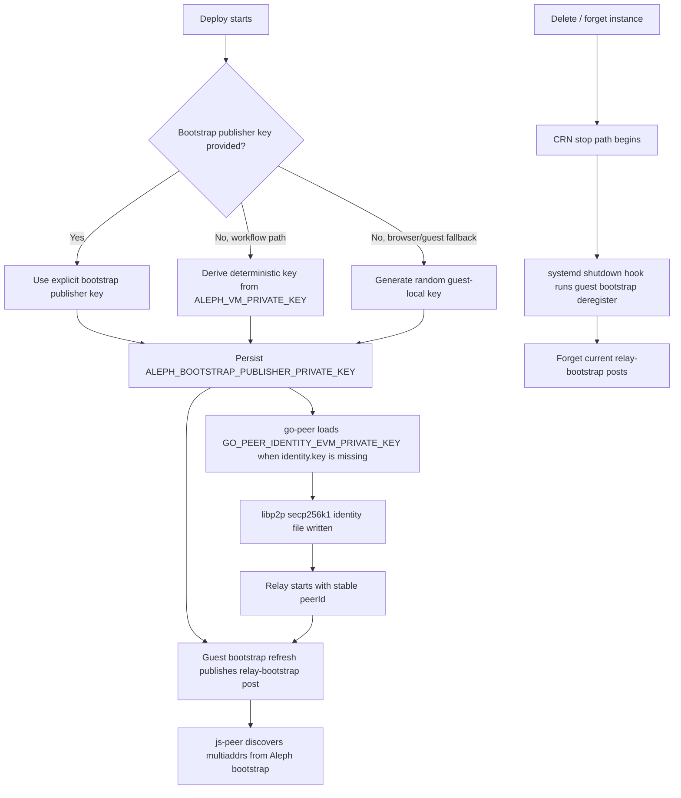

# Go Peer On Aleph

This part of `universal-connectivity` is the UC-specific entrypoint for running
the Go relay on Aleph Cloud.

At a high level, the Aleph workflow does four things:

1. build a RootFS image for the UC Go relay
2. publish that image to IPFS and pin it through Aleph
3. create an Aleph VM instance from that published RootFS
4. publish `js-peer` and let the deployed relay publish its own bootstrap
   registration for runtime discovery

This directory exists so UC maintainers can define the UC-specific contract for
that process without owning a second full copy of the reusable Aleph tooling.

## What Lives Here

- [uc-go-peer.json](./uc-go-peer.json)
  The UC-owned contract for the Aleph guest image:
  profile id, binary path, service names, ports, and manifest metadata.
- [../../../.github/workflows/build-aleph-go-peer-rootfs.yml](../../../.github/workflows/build-aleph-go-peer-rootfs.yml)
  Manual workflow entrypoint for build, publish, deploy, probe, registry
  publication, and retention.
- [../../../.github/workflows/uc-go-peer-rootfs-reusable.yml](../../../.github/workflows/uc-go-peer-rootfs-reusable.yml)
  The UC workflow that coordinates the whole Aleph lifecycle.
- [../../../.github/actions/aleph-vm-deploy/action.yml](../../../.github/actions/aleph-vm-deploy/action.yml)
  Thin compatibility wrapper around the published Aleph deploy runner.
- [./relay-probe-policy.json](./relay-probe-policy.json)
  The UC-owned relay probe policy contract that the workflow loads before
  running post-deploy relay verification.

## What The Shared Tooling Owns

The reusable implementation lives in the standalone Aleph tooling repo and the
published packages:

- `NiKrause/shared-aleph-tooling`
- `@le-space/rootfs`
- `@le-space/node`

That Aleph tooling owns:

- RootFS build orchestration
- qcow2 customization scripts
- guest bootstrap, configure, describe, and setup logic
- AutoTLS refresh behavior
- Aleph publish and pin helpers
- VM deployment logic
- site publish, relay-bootstrap registration, probe, and domain-link helpers
- deployment retention cleanup

This repo mainly defines:

- the UC RootFS contract
- the UC relay probe policy
- the UC workflow orchestration
- the browser bootstrap behavior expected by `js-peer`

## Directory Shape

This directory is intentionally flat so the UC-owned deployment contract is all
in one place:

- [uc-go-peer.json](./uc-go-peer.json)
- [relay-probe-policy.json](./relay-probe-policy.json)
- [README.md](./README.md)

## How The Aleph Flow Works

The normal manual workflow path is:

1. read `uc-go-peer.json`
2. build the UC Go relay binary
3. create an Aleph RootFS image that contains that binary and the shared guest
   scripts
4. publish the qcow2 image to IPFS
5. pin the image on Aleph and wait for the Aleph `STORE` message
6. publish `js-peer` once
7. optionally deploy an Aleph VM from that published image
8. configure the guest, collect the final relay multiaddrs, and wait for the
   relay guest to publish its bootstrap registration to Aleph for runtime
   discovery
9. optionally prune older successful deployments from Aleph

## Runtime Bootstrap Discovery

`js-peer` now discovers relay bootstrap multiaddrs at runtime through the
shared Aleph bootstrap registry instead of relying on workflow-baked constants.

That means the workflow no longer needs to rebuild or republish `js-peer` after
deployment. The publish path is:

1. publish the `js-peer` site and manifest once
2. deploy VM and inspect the real relay addresses
3. publish the relay bootstrap registration to Aleph
4. let `js-peer` discover fresh bootstrap multiaddrs at startup

This is still important for Aleph because the externally reachable relay ports
are assigned by the VM runtime and are not known ahead of time. The difference
is that the dynamic registry absorbs that late-bound runtime information rather
than forcing a second site publish.

In the current production path on `main`, that means:

1. publish `js-peer` once
2. link the configured production domain to that site when `ALEPH_DOMAIN` is
   set
3. deploy and inspect the VM
4. publish the relay bootstrap registration to Aleph

Retention cleanup now only needs to track the single published site artifact
for the successful deployment aggregate.

## Bootstrap Publisher Identity

The relay treats the Aleph bootstrap publisher key and the libp2p relay
identity as one coherent identity source.

The strategy is:

1. use an explicit bootstrap publisher private key when one is provided
2. otherwise derive a deterministic bootstrap publisher key from the deploy
   private key in the workflow path
3. otherwise let the guest generate and persist a random local bootstrap
   publisher key

For `go-peer`, that same key also seeds the libp2p identity file whenever the
relay starts without an existing `identity.key`, so the resulting `peerId` and
Aleph bootstrap publisher address stay aligned.

For the browser Sponsor Relay path, the relay VM is now responsible for
publishing its own Aleph bootstrap registration after configure. The browser
waits for that guest-published registration instead of publishing bootstrap
records with the wallet address as a mismatched sender.

### Shutdown Cleanup

The preferred delete behavior is now guest-driven:

1. delete/forget requests ask Aleph to stop the VM
2. the guest receives a normal stop path when the CRN shutdown is graceful
3. a systemd shutdown hook runs a best-effort Aleph bootstrap deregistration
   with the guest's own publisher key

This is still best-effort, not a cryptographic guarantee. If a CRN has to
escalate past graceful shutdown, stale bootstrap posts are still possible, so
owner-side reconcile remains a safety net.

## Bootstrap Identity Flow



## Browser Example

The browser integration remains intentionally small. The important part is that
the UI points at the current `uc-go-peer` manifest and then waits for the guest
to publish its own bootstrap record:

```tsx
<SponsorRelayFab
  manifestUrl="https://connect.nicokrause.com/rootfs/uc-go-peer/latest.json"
  sshPublicKey={process.env.NEXT_PUBLIC_VM_SSH_PUBLIC_KEY ?? ""}
  showInstances={true}
  instanceName="uc-relay"
  launcherMode="inline"
/>
```

Operationally:

- workflow deploys can still pre-seed a deterministic bootstrap publisher key
- browser deploys can rely on the guest fallback path
- both paths converge on a guest-owned relay bootstrap registration that
  `js-peer` discovers at runtime
## AutoTLS, Direct WSS, And Proxy WSS

There are two browser-relevant secure websocket paths:

- AutoTLS / direct WSS
  The relay itself advertises `*.libp2p.direct` addresses through libp2p
  AutoTLS when that registration succeeds.
- proxy / Caddy WSS
  The Aleph proxy hostname on port `443`, fronted by guest Caddy inside the VM.

Both matter, but for different reasons.

### AutoTLS

AutoTLS gives the relay first-party secure websocket addresses such as
`/dns4/...libp2p.direct/tcp/.../tls/ws/...`.

This path is desirable because it does not depend on the Aleph proxy hostname.
However, it can be slower or operationally unreliable because it depends on
upstream libp2p.direct registration and certificate issuance.

The guest refresh service keeps trying to detect successful AutoTLS publication
later and update the runtime bootstrap state when those addresses become
available.

### Caddy And The Aleph Proxy URL

Aleph VMs are usually exposed on high mapped egress ports. Those direct ports
often work fine on open networks, but they are also the first thing that tends
to break in:

- corporate networks
- restrictive VPNs
- school or hotel Wi-Fi
- firewalled browser environments

That is why the workflow can enable the Aleph web proxy hostname plus guest
Caddy. This gives us a `443`-based WSS path such as:

- `/dns4/<proxy-host>/tcp/443/tls/ws/p2p/<peerId>`

Operationally, this proxy path is often the most resilient browser bootstrap
option, even when the relay’s direct high port is blocked by the network the
user is on.

In short:

- AutoTLS / direct WSS is ideal when available
- proxy / Caddy WSS is the compatibility path for restrictive networks

## Relay Probe Policy

After guest configuration, the workflow probes the returned relay multiaddrs.

The ownership split for that probe is:

- shared-aleph-tooling owns the probe runner implementation in
  `packages/node/src/relay-probe.ts`
- `universal-connectivity` owns the policy contract in
  `go-peer/aleph/relay-probe-policy.json`
- `.github/workflows/uc-go-peer-rootfs-reusable.yml` loads that file and passes
  the resolved values into the probe runner through environment variables

The UC policy contract is:

- file:
  - `go-peer/aleph/relay-probe-policy.json`
- workflow loader:
  - `.github/workflows/uc-go-peer-rootfs-reusable.yml`
- current env contract passed to the runner:
  - `ALEPH_RELAY_PROBE_REQUIRED_FAMILIES_JSON`
  - `ALEPH_RELAY_PROBE_BEST_EFFORT_FAMILIES_JSON`
  - `ALEPH_RELAY_PROBE_PROXY_WSS_HOST_MATCHERS_JSON`
  - `PROBE_TIMEOUT_MS`
  - `PROBE_SETTLE_MS`

The current policy is:

- required probe families:
  - direct TCP
  - direct WSS via `libp2p.direct`
  - proxy WSS via the Aleph proxy hostname when enabled
  - WebTransport
- best-effort probe family:
  - `webrtc-direct`

Operationally, `webrtc-direct` was more fragile than the required transports.
The workflow still records `webrtc-direct` warnings in probe output for
debugging, but a `webrtc-direct` parsing or ping failure does not block the
publish, registry-publication, domain-link, or retention path as long as the
required transports succeeded.

The current concrete values in `relay-probe-policy.json` are:

- `requiredFamilies`: `["tcp","direct-wss","proxy-wss","webtransport"]`
- `bestEffortFamilies`: `["webrtc-direct"]`
- `proxyWssHostMatchers`: `[".2n6.me/"]`
- `timeoutMs`: `20000`
- `settleMs`: `1500`
## Current Guest Model

The UC contract currently uses:

- support directory: `/opt/go-peer`
- relay executable: `/usr/local/bin/universal-chat-go`
- data directory: `/var/lib/uc-go-peer`
- env file: `/etc/default/uc-go-peer`

The RootFS image is prebaked. The relay binary and shared guest scripts are put
into the image before publishing, so the Aleph VM does not need to assemble its
runtime from scratch after boot.

## Maintainer Notes

- UC intentionally uses the package-based Aleph integration path.
  The workflows install `@le-space/node` and call runner modes such as:
  `runRootfsMode(...)`, `runSiteMode(...)`, and `runActionMode(...)`.
- This keeps workflow ownership in UC while the low-level Aleph implementation
  stays reusable in the shared tooling repo.
- If you need to change guest behavior itself, the implementation most likely
  lives in `shared-aleph-tooling`, not here.
- If you need to change the UC deployment contract, ports, manifest notes, or
  workflow behavior, this repo is the right place.
- Retention currently keeps the latest two successful published+deployed
  records, prunes older deployment records and their dependent `STORE`
  messages, and may also prune the initial site publish from the newest run
  after the final republished site replaces it.
