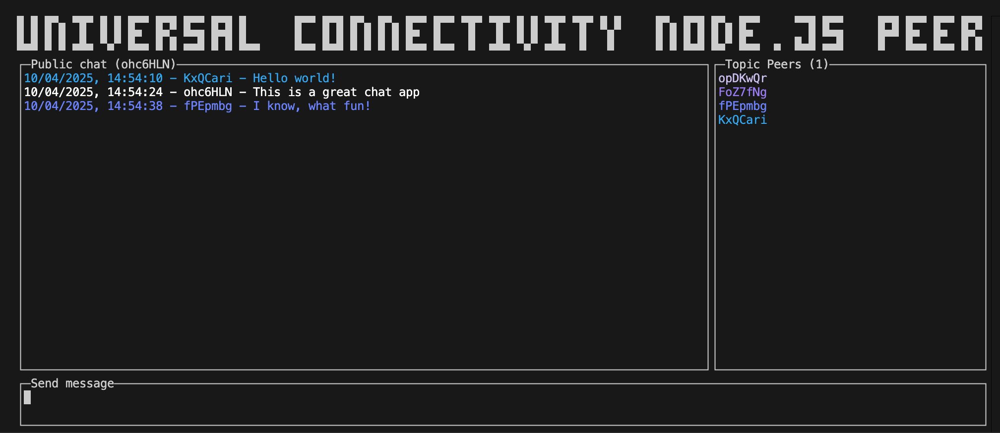

# Node.js peer

This is a JavaScript peer for the Universal Connectivity app implemented as a
command line app using a Terminal User Interface aimed at Node.js.

The TUI is implemented using [react-curse](https://www.npmjs.com/package/react-curse),
a JavaScript so should be familiar to anyone who has used [React](https://react.dev/) before.

## Getting Started

To start the app run:

```bash
npm start
# or
yarn start
# or
pnpm start
```

You should see a terminal user interface similar to this:



Use `CTRL-C` to exit the app.

## Hacking

You can start editing the app by modifying [./App.tsx](./App.tsx) and restarting the app.

The libp2p configuration can be found in [./lib/libp2p.ts](./lib/libp2p.ts).

## Relay Probe

To quickly test a deployed relay address without opening the TUI, use the probe
script:

```bash
npm run probe:relay -- "<multiaddr>"
```

Examples:

```bash
# Direct forwarded TCP address
npm run probe:relay -- "/ip4/93.186.192.85/tcp/24004/p2p/12D3Koo..."

# AutoTLS secure websocket address published by go-peer itself
npm run probe:relay -- "/dns4/k51qzi5uqu5di...libp2p.direct/tcp/24004/tls/ws/p2p/12D3Koo..."

# Optional Aleph proxy / Caddy-backed secure websocket address
npm run probe:relay -- "/dns4/example.2n6.me/tcp/443/tls/ws/p2p/12D3Koo..."
```

You can pass multiple multiaddrs in one invocation:

```bash
npm run probe:relay -- "<addr-1>" "<addr-2>" "<addr-3>"
```

Each result is printed as one JSON line with:

- `ok`: whether the dial succeeded
- `dialMs`: dial duration in milliseconds
- `pingMs`: follow-up ping duration when available
- `remoteAddrs`: remote connection addresses observed after dial
- `error`: failure detail when a probe fails

Options:

```bash
npm run probe:relay -- "<multiaddr>" --timeout-ms 20000 --settle-ms 1500
```

Notes:

- The target multiaddr should include `/p2p/<peerId>`.
- This is the best lightweight validation for direct TCP, AutoTLS/WSS, and
  optional proxy `443` after a deployment.

## Learn More

To learn more about libp2p, take a look at the following resources:

- [js-libp2p on GitHub](https://github.com/libp2p/js-libp2p) - The js-libp2p repo
- [API docs](https://libp2p.github.io/js-libp2p/) - API documentation
- [Docs](https://github.com/libp2p/js-libp2p/tree/main/doc) - Longer form docs
- [Examples](https://github.com/libp2p/js-libp2p-examples) - How to do almost anything with your libp2p node
